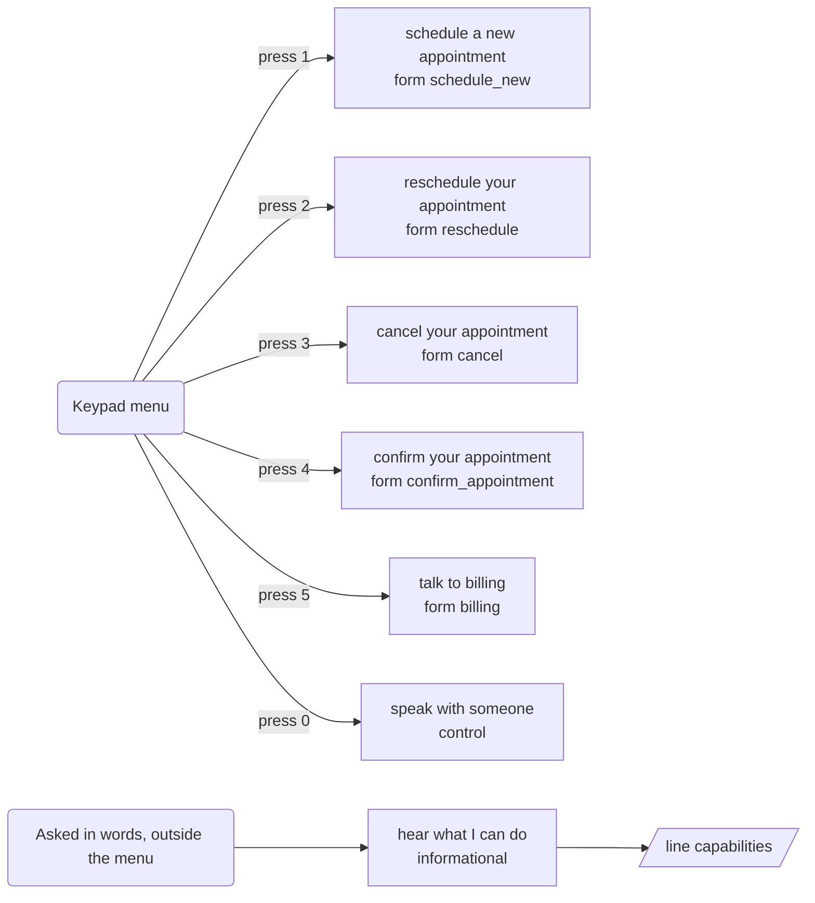
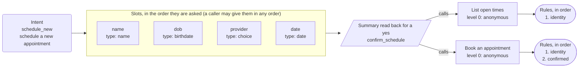
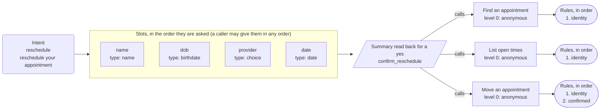
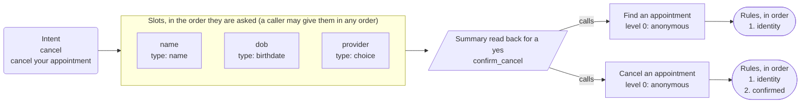
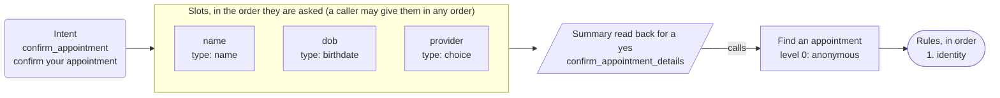
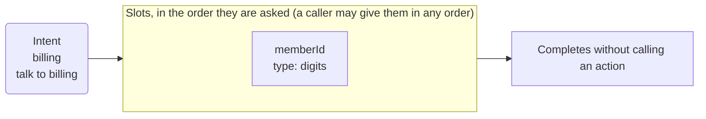

# App map: Example Family Practice

*Generated from the app's configuration by `pnpm app:diagram`: do not edit it by hand. A test fails when this page and the configuration disagree.*

**This is the structure of the app, not a script for a call.** The dialog is mixed-initiative: a caller may give details in any order, change their mind, answer two questions at once or ask for two things in a row, and the engine follows. The map shows what is connected to what.

## What a caller can ask for

| Intent | Kind | Said as | What happens |
| --- | --- | --- | --- |
| `schedule_new` | form | schedule a new appointment | opens the form, which asks for name, date of birth, provider, day |
| `reschedule` | form | reschedule your appointment | opens the form, which asks for name, date of birth, provider, day |
| `cancel` | form | cancel your appointment | opens the form, which asks for name, date of birth, provider |
| `confirm_appointment` | form | confirm your appointment | opens the form, which asks for name, date of birth, provider |
| `billing` | form | talk to billing | opens the form, which asks for member ID |
| `agent` | control | speak with someone | handled by the engine |
| `repeat_prompt` | control | hear that again | handled by the engine |
| `capabilities` | informational | hear what I can do | says "I can help you schedule, reschedule, cancel, or confirm an appointment, or connect you ..." and goes back to the question |
| `other` | control | something else | handled by the engine |
| `none` | control | nothing | handled by the engine |

## The keypad menu and the lines that are only said

## Schedule an appointment

Intent `schedule_new` to its slots, the summary, the action and its rules.

## Reschedule an appointment

Intent `reschedule` to its slots, the summary, the action and its rules.

## Cancel an appointment

Intent `cancel` to its slots, the summary, the action and its rules.

## Confirm an appointment

Intent `confirm_appointment` to its slots, the summary, the action and its rules.

## Billing

Intent `billing` to its slots, the summary, the action and its rules.

## Dangling references

None: every intent reaches a form or a line, and every action is reached by a form or the identity flow.
