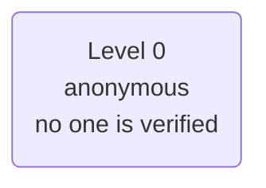
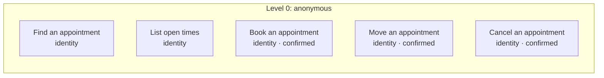

# Policy card: Example Family Practice

*Generated from `policy.yaml` and `identity.yaml` by `pnpm policy:card`: do not edit it by hand. Change the files, write the card again, and review the diff. A test fails when this page and the files disagree.*

| File | Config hash |
| --- | --- |
| `policy.yaml` | `527fce34e8b8b32e4be24b13c80b022b78b2c52ae1f65a2b01d476e3043c7ead` |
| `identity.yaml` | none: this app verifies no one |

The hash is a SHA-256 of the file's content (comments and layout do not change it); every call's audit record carries the hashes it ran under.

## Defaults

- Anything not listed under Actions is refused.
- The rules of an action run in the order shown, and the first one that fails decides.
- Identifiers in decision lines appear by their last four characters (`...1234`), never in full; a value recorded hidden, by length or never shows not even those.
- In traces and the audit a caller's values are recorded as they are said, except: date of birth hidden (a year is kept); member ID by its last four.

## Identity

This app verifies no one. Every caller stays anonymous (level 0), so every action is at level 0.

## Who is served and who acts for them

No one is verified, so the app has no subjects and no one acts for them.

## What is recorded

What the record of a call keeps of each value the action is sent: the gate's decision, the trace, the console and the audit. A value is recorded as its slot says or as policy.yaml's `audit` declares, and `check` refuses one that neither covers. Where a rule's line, the action's summary or its own audit rows repeat a value that is hidden, shortened or never recorded, it is masked there too.

| Action | Value | Recorded |
| --- | --- | --- |
| Find an appointment (`findAppointment`) | name (`name`) | as it is |
| Find an appointment (`findAppointment`) | date of birth (`dob`) | hidden |
| Find an appointment (`findAppointment`) | provider (`provider`) | as it is |
| List open times (`listOpenings`) | provider (`provider`) | as it is |
| List open times (`listOpenings`) | day (`date`) | as it is |
| Book an appointment (`bookAppointment`) | name (`name`) | as it is |
| Book an appointment (`bookAppointment`) | date of birth (`dob`) | hidden |
| Book an appointment (`bookAppointment`) | provider (`provider`) | as it is |
| Book an appointment (`bookAppointment`) | day (`date`) | as it is |
| Book an appointment (`bookAppointment`) | time (`time`) | as it is |
| Move an appointment (`moveAppointment`) | name (`name`) | as it is |
| Move an appointment (`moveAppointment`) | date of birth (`dob`) | hidden |
| Move an appointment (`moveAppointment`) | provider (`provider`) | as it is |
| Move an appointment (`moveAppointment`) | day (`date`) | as it is |
| Move an appointment (`moveAppointment`) | time (`time`) | as it is |
| Cancel an appointment (`cancelAppointment`) | name (`name`) | as it is |
| Cancel an appointment (`cancelAppointment`) | date of birth (`dob`) | hidden |
| Cancel an appointment (`cancelAppointment`) | provider (`provider`) | as it is |
| Cancel an appointment (`cancelAppointment`) | day (`date`) | as it is |
| Cancel an appointment (`cancelAppointment`) | time (`time`) | as it is |

## Actions

One row per action the agent may take. Anything else is refused.

| Action | Level | The gate checks, in order |
| --- | --- | --- |
| **Find an appointment** `findAppointment` | 0 anonymous | 1. any caller may ask, verified or not |
| **List open times** `listOpenings` | 0 anonymous | 1. any caller may ask, verified or not |
| **Book an appointment** `bookAppointment` | 0 anonymous | 1. any caller may ask, verified or not 2. the caller must confirm exactly these values at the read-back, and nothing else is sent: name, date of birth, provider, day and time |
| **Move an appointment** `moveAppointment` | 0 anonymous | 1. any caller may ask, verified or not 2. the caller must confirm exactly these values at the read-back, and nothing else is sent: name, date of birth, provider, day and time |
| **Cancel an appointment** `cancelAppointment` | 0 anonymous | 1. any caller may ask, verified or not 2. the caller must confirm exactly these values at the read-back, and nothing else is sent: name, date of birth, provider, day and time |

### Actions by level, with their rules and what each role gets

