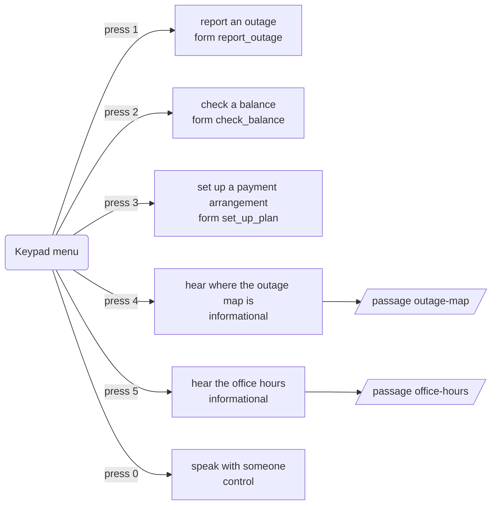
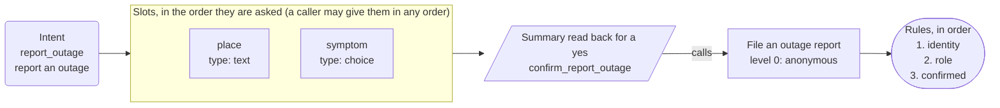
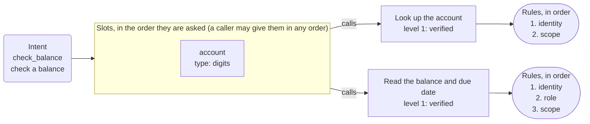
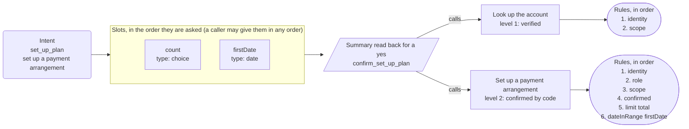
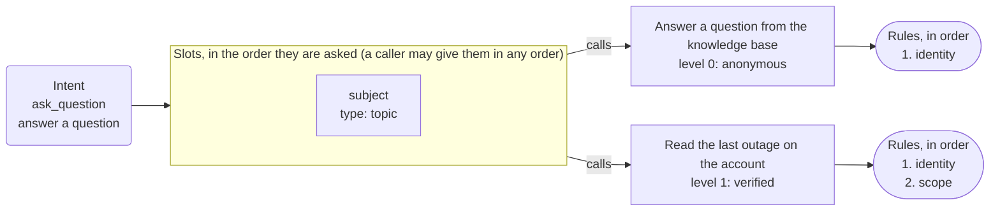

# App map: Example Power & Light

*Generated from the app's configuration by `pnpm app:diagram`: do not edit it by hand. A test fails when this page and the configuration disagree.*

**This is the structure of the app, not a script for a call.** The dialog is mixed-initiative: a caller may give details in any order, change their mind, answer two questions at once or ask for two things in a row, and the engine follows. The map shows what is connected to what.

## What a caller can ask for

| Intent | Kind | Said as | What happens |
| --- | --- | --- | --- |
| `report_outage` | form | report an outage | opens the form, which asks for address, what they see |
| `check_balance` | form | check a balance | opens the form, which asks for account |
| `set_up_plan` | form | set up a payment arrangement | opens the form, which asks for installments, first payment |
| `ask_question` | form | answer a question | opens the form, which asks for question topic |
| `outage_map` | informational | hear where the outage map is | says the passage outage-map from the knowledge base and goes back to the question |
| `office_hours` | informational | hear the office hours | says the passage office-hours from the knowledge base and goes back to the question |
| `agent` | control | speak with someone | handled by the engine |
| `repeat_prompt` | control | hear that again | handled by the engine |
| `done` | control | finish up | handled by the engine |
| `other` | control | something else | handled by the engine |
| `none` | control | nothing | handled by the engine |

## The keypad menu and the lines that are only said

## Report an outage

Intent `report_outage` to its slots, the summary, the action and its rules.

## Check a balance

Intent `check_balance` to its slots, the summary, the action and its rules.

## Set up a payment arrangement

Intent `set_up_plan` to its slots, the summary, the action and its rules.

## Answer a question

Intent `ask_question` to its slots, the summary, the action and its rules.

## Dangling references

None: every intent reaches a form or a line, and every action is reached by a form or the identity flow.
