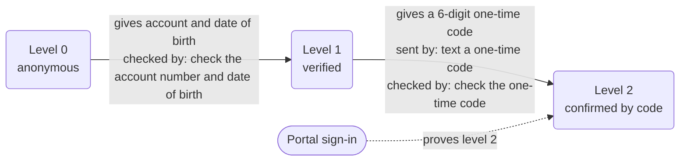
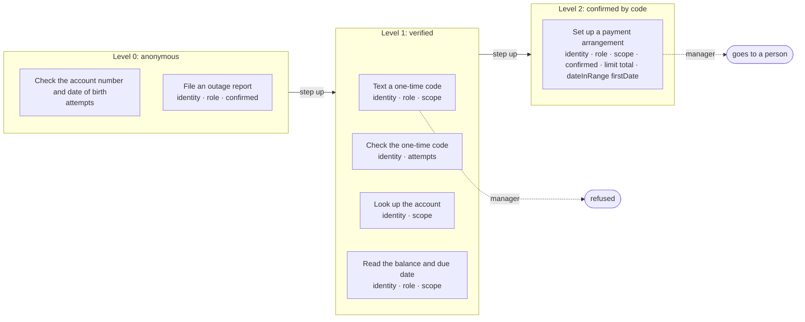

# Policy card: Example Power & Light

*Generated from `policy.yaml` and `identity.yaml` by `pnpm policy:card`: do not edit it by hand. Change the files, write the card again, and review the diff. A test fails when this page and the files disagree.*

| File | Config hash |
| --- | --- |
| `policy.yaml` | `721b6aa2159ef77db23b0b6ce88606872362b040ed67b63b356058ca51ea6857` |
| `identity.yaml` | `70a08a016eb7eab0df6ab30fe736773c565cc32764ff494321428bd1870e939f` |

The hash is a SHA-256 of the file's content (comments and layout do not change it); every call's audit record carries the hashes it ran under.

## Defaults

- Anything not listed under Actions is refused.
- The rules of an action run in the order shown, and the first one that fails decides.
- Identifiers in decision lines appear by their last four characters (`...1234`), never in full.
- A caller has 3 tries at each identity check (the account and date of birth, and the one-time code). After that a person takes the call.
- In traces and the audit a caller's values are recorded as they are said, except: account by its last four; account by its last four; date of birth hidden (a year is kept).

## Identity

| Level | Name | What the caller gives | Checked by |
| --- | --- | --- | --- |
| 0 | anonymous | nothing | |
| 1 | verified | their account and date of birth | check the account number and date of birth (`verifyCustomer`) |
| 2 | confirmed by code | level 1, and a 6-digit one-time code sent to the contact on file | text a one-time code (`sendCode`); check the one-time code (`verifyCode`) |

- Each level includes the one below it. A customer below an action's level is asked for what the next level needs; any other caller is refused.
- The one-time code is keyed on the keypad: it is masked, never traced and never held as a slot.
- A sign-in through a portal proves level 2 ('confirmed by code'), so a signed-in caller starts there.

Some tasks need a higher level before any action is called, even where the action itself needs less:

- Set up a payment arrangement (`set_up_plan`) needs 'confirmed by code'.

## Who is served and who acts for them

- **customer**: the people the app serves. They are verified up the ladder above and may see only their own records.
- **property_manager**: acts for customers, signed in through a portal. They may see the records of the customers they act for, with a role: manager.

What each role may do, in the actions that have a role rule (a role a rule does not list is refused, and so is a party with no role):

| Role | Goes ahead | Goes to a person | Refused |
| --- | --- | --- | --- |
| manager | file an outage report read the balance and due date | set up a payment arrangement | text a one-time code |

## Actions

One row per action the agent may take. Anything else is refused.

| Action | Level | The gate checks, in order |
| --- | --- | --- |
| **Check the account number and date of birth** `verifyCustomer` | 0 anonymous | 1. the identity check has not already failed 3 times (after that a person takes the call) |
| **Text a one-time code** `sendCode` | 1 verified | 1. the caller must be at 'verified' or above 2. by role: a manager's request is refused; any other role, or none, is refused; a customer acting for themselves is not held to this rule 3. the account must be the caller's own, or one they act for |
| **Check the one-time code** `verifyCode` | 1 verified | 1. the caller must be at 'verified' or above 2. the identity check has not already failed 3 times (after that a person takes the call) |
| **File an outage report** `reportOutage` | 0 anonymous | 1. any caller may ask, verified or not 2. by role: a manager's request goes ahead; any other role, or none, is refused; a customer acting for themselves is not held to this rule 3. the caller must confirm exactly these values at the read-back, and nothing else is sent: account, address, what they see, installments, first payment and total |
| **Look up the account** `findAccount` | 1 verified | 1. the caller must be at 'verified' or above 2. the account must be the caller's own, or one they act for |
| **Read the balance and due date** `readBalance` | 1 verified | 1. the caller must be at 'verified' or above 2. by role: a manager's request goes ahead; any other role, or none, is refused; a customer acting for themselves is not held to this rule 3. the account must be the caller's own, or one they act for |
| **Set up a payment arrangement** `setUpPlan` | 2 confirmed by code | 1. the caller must be at 'confirmed by code' or above 2. by role: a manager's request goes to a person (role-person); any other role, or none, is refused; a customer acting for themselves is not held to this rule 3. the account must be the caller's own, or one they act for 4. the caller must confirm exactly these values at the read-back, and nothing else is sent: account, address, what they see, installments, first payment and total 5. the total must be at least 0.01 and at most what `amountDue(accountId)` gives (a number outside it is refused; anything that is not a number is refused) 6. the first payment must be on or after today and no later than 30 days from today (a date out of bounds is refused; anything that is not a date is refused) |

### Actions by level, with their rules and what each role gets

