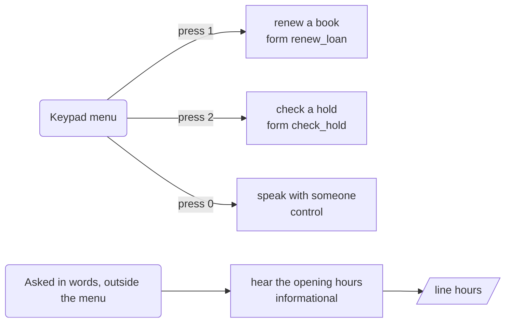
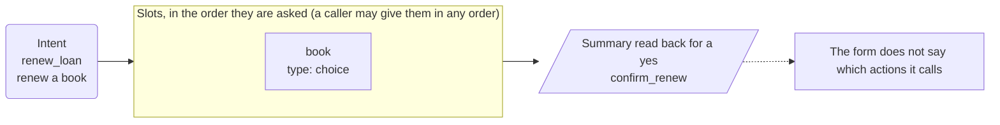
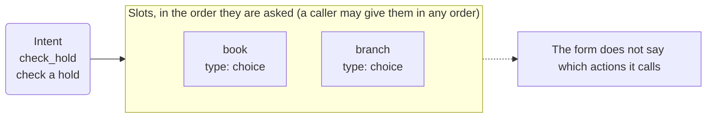
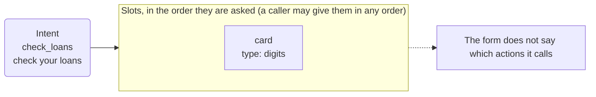

# App map: Example Town Library

*Generated from the app's configuration by `pnpm app:diagram`: do not edit it by hand. A test fails when this page and the configuration disagree.*

**This is the structure of the app, not a script for a call.** The dialog is mixed-initiative: a caller may give details in any order, change their mind, answer two questions at once or ask for two things in a row, and the engine follows. The map shows what is connected to what.

## What a caller can ask for

| Intent | Kind | Said as | What happens |
| --- | --- | --- | --- |
| `renew_loan` | form | renew a book | opens the form, which asks for book |
| `check_hold` | form | check a hold | opens the form, which asks for book, branch |
| `check_loans` | form | check your loans | opens the form, which asks for library card |
| `hours` | informational | hear the opening hours | says "Every branch is open from nine to six, Monday to Saturday." and goes back to the question |
| `agent` | control | speak with someone | handled by the engine |
| `repeat_prompt` | control | hear that again | handled by the engine |
| `done` | control | finish | handled by the engine |
| `other` | control | something else | handled by the engine |
| `none` | control | nothing | handled by the engine |

## The keypad menu and the lines that are only said

## Renew a book

Intent `renew_loan` to its slots, the summary, the action and its rules.

## Check a hold

Intent `check_hold` to its slots, the summary, the action and its rules.

## Check your loans

Intent `check_loans` to its slots, the summary, the action and its rules.

## Dangling references

None: every intent reaches a form or a line, and the forms do not declare which actions they call (`calls`), so which actions are reached is not checked.
