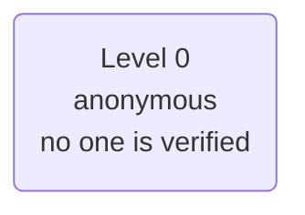
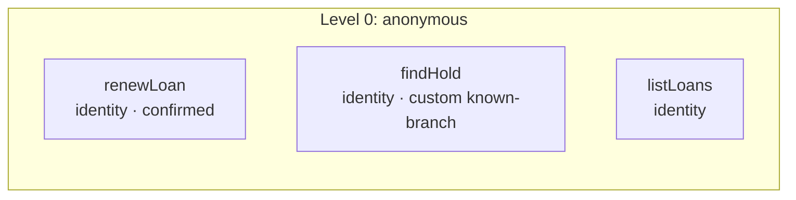

# Policy card: Example Town Library

*Generated from `policy.yaml` and `identity.yaml` by `pnpm policy:card`: do not edit it by hand. Change the files, write the card again, and review the diff. A test fails when this page and the files disagree.*

| File | Config hash |
| --- | --- |
| `policy.yaml` | `783112d39bb5e84357354f5d5299af75f3a431f565c2b479e2df8eb74521b9a4` |
| `identity.yaml` | none: this app verifies no one |

The hash is a SHA-256 of the file's content (comments and layout do not change it); every call's audit record carries the hashes it ran under.

## Defaults

- Anything not listed under Actions is refused.
- The rules of an action run in the order shown, and the first one that fails decides.
- Identifiers in decision lines appear by their last four characters (`...1234`), never in full.
- In traces and the audit a caller's values are recorded as they are said, except: library card by its last four.

## Identity

This app verifies no one. Every caller stays anonymous (level 0), so every action is at level 0.

## Who is served and who acts for them

No one is verified, so the app has no subjects and no one acts for them.

## Actions

One row per action the agent may take. Anything else is refused.

| Action | Level | The gate checks, in order |
| --- | --- | --- |
| `renewLoan` | 0 anonymous | 1. any caller may ask, verified or not 2. the caller must confirm exactly these values at the read-back, and nothing else is sent: book |
| `findHold` | 0 anonymous | 1. any caller may ask, verified or not 2. the hold is at one of the library's branches (custom rule `known-branch`) |
| `listLoans` | 0 anonymous | 1. any caller may ask, verified or not |

### Actions by level, with their rules and what each role gets

