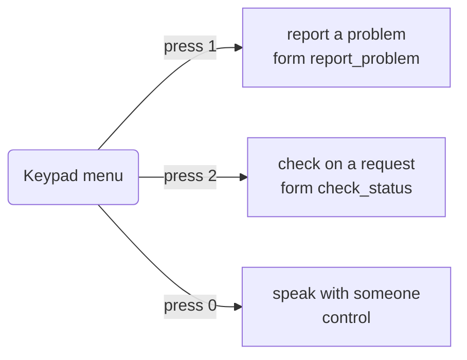
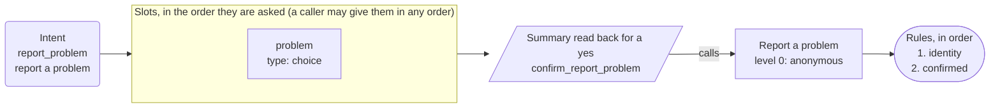
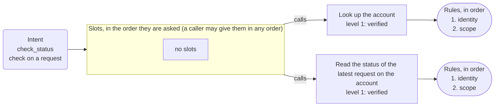

# App map: Example Account Line

*Generated from the app's configuration by `pnpm app:diagram`: do not edit it by hand. A test fails when this page and the configuration disagree.*

**This is the structure of the app, not a script for a call.** The dialog is mixed-initiative: a caller may give details in any order, change their mind, answer two questions at once or ask for two things in a row, and the engine follows. The map shows what is connected to what.

## What a caller can ask for

| Intent | Kind | Said as | What happens |
| --- | --- | --- | --- |
| `report_problem` | form | report a problem | opens the form, which asks for problem |
| `check_status` | form | check on a request | opens the form, which asks for nothing |
| `agent` | control | speak with someone | handled by the engine |
| `repeat_prompt` | control | hear that again | handled by the engine |
| `done` | control | finish up | handled by the engine |
| `other` | control | something else | handled by the engine |
| `none` | control | nothing | handled by the engine |

## The keypad menu and the lines that are only said

## Report a problem

Intent `report_problem` to its slots, the summary, the action and its rules.

## Check on a request

Intent `check_status` to its slots, the summary, the action and its rules.

## Dangling references

- no form reaches the action `findAccountByPhone`, and the identity flow does not call it
