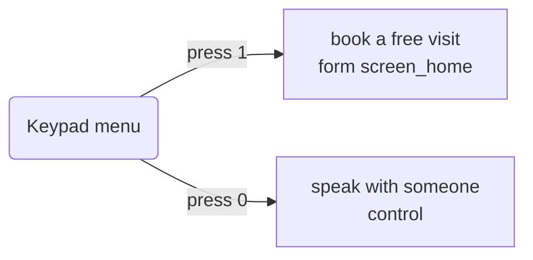
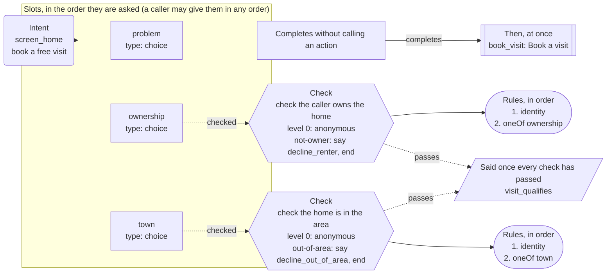
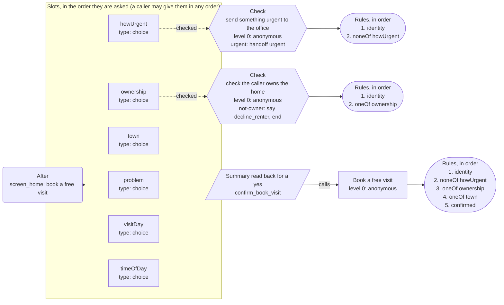
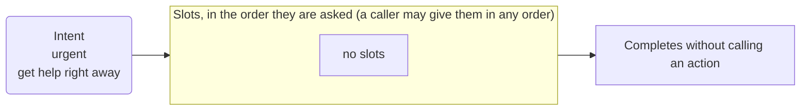

# App map: Example Home Visits

*Generated from the app's configuration by `pnpm app:diagram`: do not edit it by hand. A test fails when this page and the configuration disagree.*

**This is the structure of the app, not a script for a call.** The dialog is mixed-initiative: a caller may give details in any order, change their mind, answer two questions at once or ask for two things in a row, and the engine follows. The map shows what is connected to what.

## What a caller can ask for

| Intent | Kind | Said as | What happens |
| --- | --- | --- | --- |
| `screen_home` | form | book a free visit | opens the form, which asks for problem, owns or rents, town, then goes on to Book a visit (book_visit) |
| `urgent` | form | get help right away | opens the form, which asks for nothing |
| `agent` | control | speak with someone | handled by the engine |
| `repeat_prompt` | control | hear that again | handled by the engine |
| `done` | control | finish up | handled by the engine |
| `other` | control | something else | handled by the engine |
| `none` | control | nothing | handled by the engine |

## The keypad menu and the lines that are only said

## Book a free visit

Intent `screen_home` to its slots, the summary, the action and its rules.

## Book a visit

After `screen_home`: the internal form `book_visit`, its slots, the summary, the action and its rules.

## Something urgent

Intent `urgent` to its slots, the summary, the action and its rules.

## Dangling references

None: every intent reaches a form or a line, and every action is reached by a form or the identity flow.
