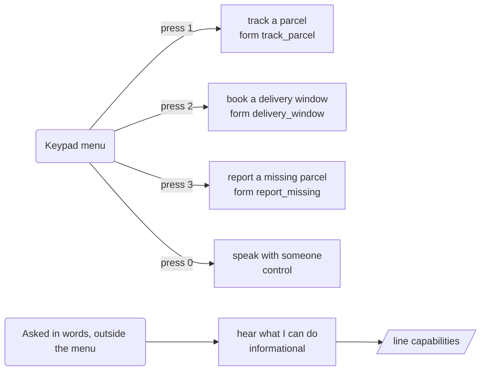
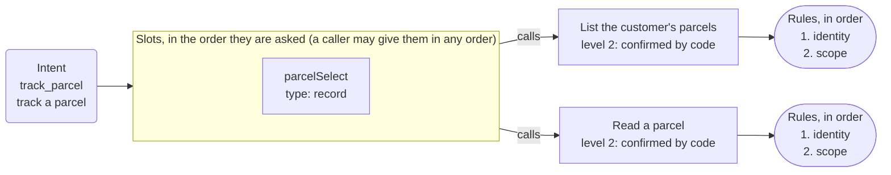
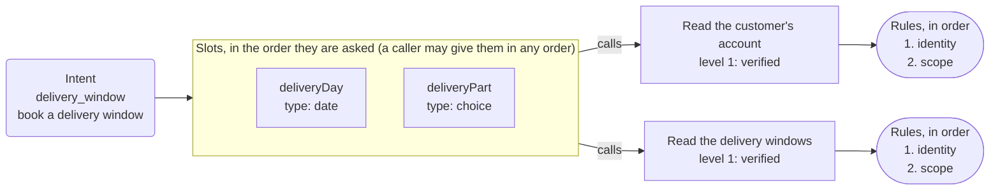
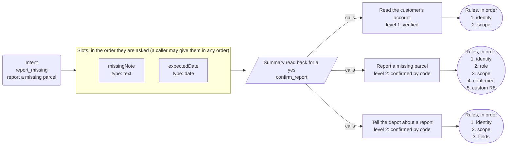

# App map: Example Parcels

*Generated from the app's configuration by `pnpm app:diagram`: do not edit it by hand. A test fails when this page and the configuration disagree.*

**This is the structure of the app, not a script for a call.** The dialog is mixed-initiative: a caller may give details in any order, change their mind, answer two questions at once or ask for two things in a row, and the engine follows. The map shows what is connected to what.

## What a caller can ask for

| Intent | Kind | Said as | What happens |
| --- | --- | --- | --- |
| `track_parcel` | form | track a parcel | opens the form, which asks for parcel |
| `delivery_window` | form | book a delivery window | opens the form, which asks for delivery day, time of day |
| `report_missing` | form | report a missing parcel | opens the form, which asks for description, due date |
| `agent` | control | speak with someone | handled by the engine |
| `repeat_prompt` | control | hear that again | handled by the engine |
| `capabilities` | informational | hear what I can do | says "I'm the Example Parcels assistant. I can tell you where a parcel is, check a delivery w..." and goes back to the question |
| `done` | control | finish up | handled by the engine |
| `other` | control | something else | handled by the engine |
| `none` | control | nothing | handled by the engine |

## The keypad menu and the lines that are only said

## Track a parcel

Intent `track_parcel` to its slots, the summary, the action and its rules.

## Delivery window

Intent `delivery_window` to its slots, the summary, the action and its rules.

## Report a missing parcel

Intent `report_missing` to its slots, the summary, the action and its rules.

## Dangling references

None: every intent reaches a form or a line, and every action is reached by a form or the identity flow.
