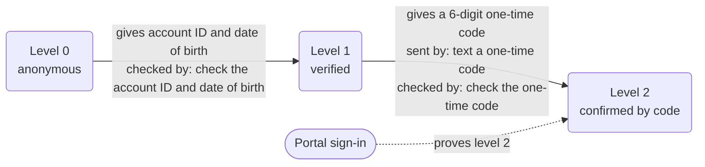
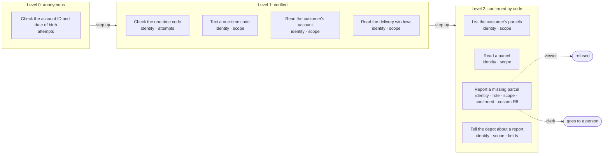

# Policy card: Example Parcels

*Generated from `policy.yaml` and `identity.yaml` by `pnpm policy:card`: do not edit it by hand. Change the files, write the card again, and review the diff. A test fails when this page and the files disagree.*

| File | Config hash |
| --- | --- |
| `policy.yaml` | `39a14e79e04b152e962c81605af16fd8716c2716f3a51b2318a399a28a731c5c` |
| `identity.yaml` | `6692c172f4a0b784e6993d801acfd608af150561fa09e2f75e29c2eea1389d3a` |

The hash is a SHA-256 of the file's content (comments and layout do not change it); every call's audit record carries the hashes it ran under.

## Defaults

- Anything not listed under Actions is refused.
- The rules of an action run in the order shown, and the first one that fails decides.
- Identifiers in decision lines appear by their last four characters (`...1234`), never in full.
- A caller has 3 tries at each identity check (the account ID and date of birth, and the one-time code). After that a person takes the call.
- In traces and the audit a caller's values are recorded as they are said, except: account ID by its last four; date of birth hidden (a year is kept); description by its length.

## Identity

| Level | Name | What the caller gives | Checked by |
| --- | --- | --- | --- |
| 0 | anonymous | nothing | |
| 1 | verified | their account ID and date of birth | check the account ID and date of birth (`verifyCustomer`) |
| 2 | confirmed by code | level 1, and a 6-digit one-time code sent to the contact on file | text a one-time code (`sendCode`); check the one-time code (`verifyCode`) |

- Each level includes the one below it. A customer below an action's level is asked for what the next level needs; any other caller is refused.
- The one-time code is keyed on the keypad: it is masked, never traced and never held as a slot.
- A sign-in through a portal proves level 2 ('confirmed by code'), so a signed-in caller starts there.

Some tasks need a higher level before any action is called, even where the action itself needs less:

- Report a missing parcel (`report_missing`) needs 'confirmed by code'.

## Who is served and who acts for them

- **customer**: the people the app serves. They are verified up the ladder above and may see only their own records.
- **agent**: acts for customers, signed in through a portal. They may see the records of the customers they act for, with a role: viewer, clerk.

What each role may do, in the actions that have a role rule (a role a rule does not list is refused, and so is a party with no role):

| Role | Goes ahead | Goes to a person | Refused |
| --- | --- | --- | --- |
| viewer | none | none | report a missing parcel |
| clerk | none | report a missing parcel | none |

## What is withheld

A party who acts for customers does not see every field of what some actions return: the engine sets these fields to nothing after the action runs, before a line, the session, the trace, the console or the audit reads the result, and the record of the call says which were withheld. A row for a role replaces its kind's for that action. A customer acting for themselves sees the whole of their own record.

| Who | Action | Fields withheld |
| --- | --- | --- |
| agent, any role | Read a parcel (`getParcel`) | `safePlace` |
| agent, any role | List the customer's parcels (`listParcels`) | `safePlace` |
| agent, as clerk | Read a parcel (`getParcel`) | none |
| agent, as clerk | List the customer's parcels (`listParcels`) | none |

## Actions

One row per action the agent may take. Anything else is refused.

| Action | Level | The gate checks, in order |
| --- | --- | --- |
| **Check the account ID and date of birth** `verifyCustomer` | 0 anonymous | 1. the identity check has not already failed 3 times (after that a person takes the call) |
| **Check the one-time code** `verifyCode` | 1 verified | 1. the caller must be at 'verified' or above 2. the identity check has not already failed 3 times (after that a person takes the call) |
| **Text a one-time code** `sendCode` | 1 verified | 1. the caller must be at 'verified' or above 2. the account ID must be the caller's own, or one they act for |
| **Read the customer's account** `getAccount` | 1 verified | 1. the caller must be at 'verified' or above 2. the account ID must be the caller's own, or one they act for |
| **Read the delivery windows** `getWindows` | 1 verified | 1. the caller must be at 'verified' or above 2. the account ID must be the caller's own, or one they act for |
| **List the customer's parcels** `listParcels` | 2 confirmed by code | 1. the caller must be at 'confirmed by code' or above 2. the account ID must be the caller's own, or one they act for |
| **Read a parcel** `getParcel` | 2 confirmed by code | 1. the caller must be at 'confirmed by code' or above 2. the parcel must belong to the caller, or to someone they act for |
| **Report a missing parcel** `createReport` | 2 confirmed by code | 1. the caller must be at 'confirmed by code' or above 2. by role: a viewer's request is refused; a clerk's request goes to a person (role-person); any other role, or none, is refused; a customer acting for themselves is not held to this rule 3. the account ID must be the caller's own, or one they act for 4. the caller must confirm exactly these values at the read-back, and nothing else is sent: account ID, description and due date 5. no parcel of the customer's was delivered on the day it was due (custom rule `R8`) |
| **Tell the depot about a report** `notifyDepot` | 2 confirmed by code | 1. the caller must be at 'confirmed by code' or above 2. the report must belong to the caller, or to someone they act for 3. only these fields are sent: `report`, `missingNote`, `expectedDate` |

### Actions by level, with their rules and what each role gets

