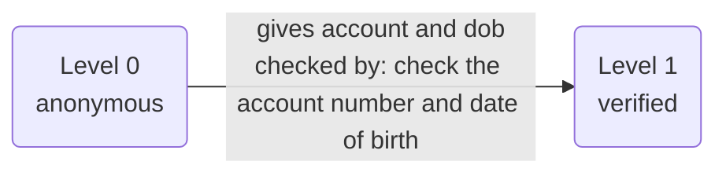
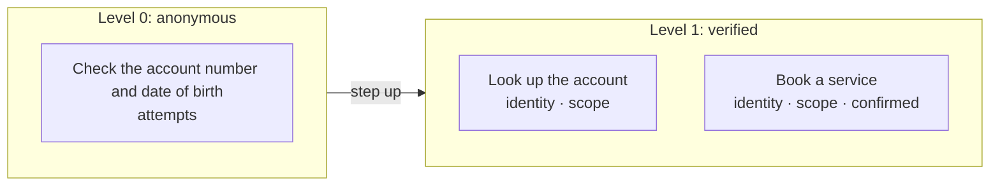

# Policy card: {{display}}

*Generated from `policy.yaml` and `identity.yaml` by `pnpm policy:card`: do not edit it by hand. Change the files, write the card again, and review the diff. A test fails when this page and the files disagree.*

| File | Config hash |
| --- | --- |
| `policy.yaml` | `a3c2cf7f8a5e83976440f174d6e9a40cb180143dbf61c10baee8da9045032839` |
| `identity.yaml` | `d280e015ac89a777365afc2527b33dac828c4cc8af5555e3aa9228e2a583bf2e` |

The hash is a SHA-256 of the file's content (comments and layout do not change it); every call's audit record carries the hashes it ran under.

## Defaults

- Anything not listed under Actions is refused.
- The rules of an action run in the order shown, and the first one that fails decides.
- Identifiers in decision lines appear by their last four characters (`...1234`), never in full; a value recorded hidden, by length or never shows not even those.
- A caller has 3 tries at each identity check (the account and dob). After that a person takes the call.
- In traces and the audit a caller's values are recorded as they are said, except: account by its last four; dob hidden (the trace keeps only its year, `••/••/1985`; a call as recorded, in the gate's decision, the console and the audit, shows `•`).

## Identity

| Level | Name | What the caller gives | Checked by |
| --- | --- | --- | --- |
| 0 | anonymous | nothing | |
| 1 | verified | their account and dob | check the account number and date of birth (`verifyCustomer`) |

- Each level includes the one below it. A customer below an action's level is asked for what the next level needs; any other caller is refused.
- The identity checks (check the account number and date of birth, `verifyCustomer`) are for customers only: a caller not yet verified may use them, and any other party (one who acts for customers, or anyone else) is refused them before their rules run.
- The app takes no portal sign-in: every caller proves who they are on the call, and a caller on a channel that signs callers in (a web chat) whose request needs identity goes to a person.

## Who is served and who acts for them

- **customer**: the people the app serves. They are verified up the ladder above and may see only their own records.
- No party acts for them on this app.

## What is recorded

What the record of a call keeps of each value the action is sent: the gate's decision, the trace, the console and the audit. A value is recorded as its slot says or as policy.yaml's `audit` declares, and `check` refuses one that neither covers. Where a rule's line, the action's summary, its own audit rows, the side effects it queues (as recorded) or a downstream service's row for the answer repeat a value that is hidden, shortened or never recorded, it is masked there too.

| Action | Value | Recorded |
| --- | --- | --- |
| Check the account number and date of birth (`verifyCustomer`) | account (`accountId`) | by its last four characters |
| Check the account number and date of birth (`verifyCustomer`) | dob (`dob`) | hidden (`•`) |
| Look up the account (`findAccount`) | account (`accountId`) | by its last four characters |
| Book a service (`bookService`) | account (`accountId`) | by its last four characters |
| Book a service (`bookService`) | service (`service`) | as it is |

## Actions

One row per action the agent may take. Anything else is refused.

| Action | Level | The gate checks, in order |
| --- | --- | --- |
| **Check the account number and date of birth** `verifyCustomer` | 0 anonymous | 1. only a customer, or a caller not yet verified, may use it (any other party is refused) 2. the identity check has not already failed 3 times (after that a person takes the call) |
| **Look up the account** `findAccount` | 1 verified | 1. the caller must be at 'verified' or above 2. the account must be the caller's own, or one they act for |
| **Book a service** `bookService` | 1 verified | 1. the caller must be at 'verified' or above 2. the account must be the caller's own, or one they act for 3. the caller must confirm exactly these values at the read-back, and nothing else is sent: account and service |

### Actions by level, with their rules and what each role gets

